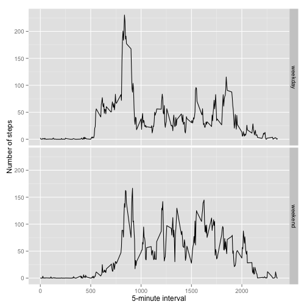

# Reproducible Research: Peer Assessment 1

Setup `knitr` options.

```r
opts_chunk$set(message = FALSE)
```

## Load needed libraries

```r
library(ggplot2)
library(ggplot2)
library(plyr)
library(reshape2)
```

## Loading and preprocessing the data

```r
unzip(zipfile="activity.zip")
data <- read.csv("activity.csv",stringsAsFactors=F)
data$date <- as.Date(data$date, format="%Y-%m-%d")
```


## What is mean total number of steps taken per day?

```r
data1 <- na.omit(data)
steps <- tapply(data1$steps,factor(data1$date),FUN = sum)
qplot(steps,
      main="Histogram of total number of steps per day",
      xlab="Total number of steps in a day")
```

 

```r
mean(steps)
```

```
## [1] 10766
```

```r
median(steps)
```

```
## [1] 10765
```


## What is the average daily activity pattern?

```r
data.m <- melt(data,id=c("interval","date"),na.rm = T)
avgs <- dcast(data.m,interval~variable,mean)
ggplot(data=avgs,aes(x=interval,y=steps)) +
    geom_line() +
    xlab("5-minute interval") +
    ylab("average number of steps taken")
```

 

On average across all the days in the dataset, the 5-minute interval contains
the maximum number of steps?

```r
avgs[which.max(avgs$steps),]$interval
```

```
## [1] 835
```


## Imputing missing values

```r
sum(is.na(data$steps))
```

```
## [1] 2304
```
## Replace each missing value with the mean value of its 5-minute interval

```r
#the impute function returns the mean value of its 5-minute interval
impute <- function(interval, steps) {
    imputed <- NA
    if(!is.na(steps))
        imputed <- steps
    else
        imputed <- avgs[avgs$interval==interval,"steps"]
    return(imputed)
}

imputed_data <- data
imputed_data$steps <- mapply(impute,imputed_data$interval,imputed_data$steps)
```

Then, using the imputed data, we make a histogram of the total number of steps taken each day and Calculate and report the mean and median total number of steps taken per day.


```r
steps <- tapply(imputed_data$steps, factor(imputed_data$date), FUN=sum)
qplot(steps, xlab="total number of steps taken each day")
```

 

```r
mean(steps)
```

```
## [1] 10766
```

```r
median(steps)
```

```
## [1] 10766
```

The imputation slightly impacted on the median total number of steps taken per day. The mean total number of steps taken per day remained the same. Considering our imputation is based on the mean value in the same interval group, it is safe to say that the mean will remain the same; as for the median, the impact is neglible.


## Are there differences in activity patterns between weekdays and weekends?
First, create a new factor variable indicating whether the day is a weekday or weekend.

```r
imputed_data$Weekday <- as.factor(ifelse(weekdays(imputed_data$date) %in% c("Saturday","Sunday"),"weekend","weekday"))
```

Then, let's make a panel plot containing plots of average number of steps taken
on weekdays and weekends.

```r
# date variable is not useful in the analysis
melted <- melt(imputed_data[,-2],id=c("interval","Weekday"))
avgs <- dcast(melted,Weekday+interval~variable,mean)
ggplot(avgs, aes(interval, steps)) + geom_line() + facet_grid(Weekday ~ .) +
    xlab("5-minute interval") + ylab("Number of steps")
```

 


